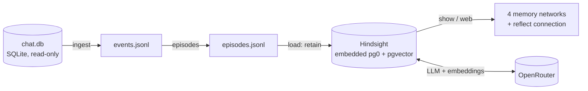
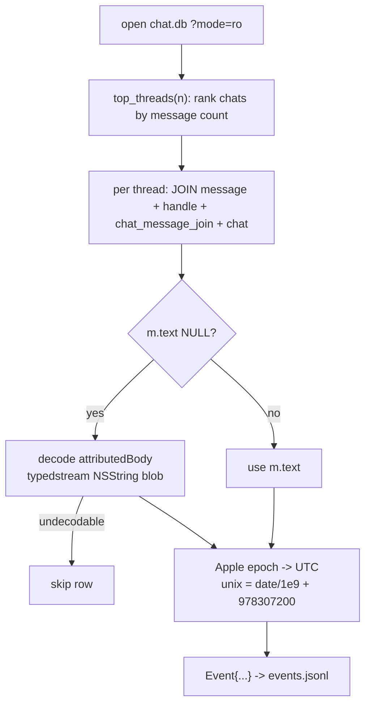
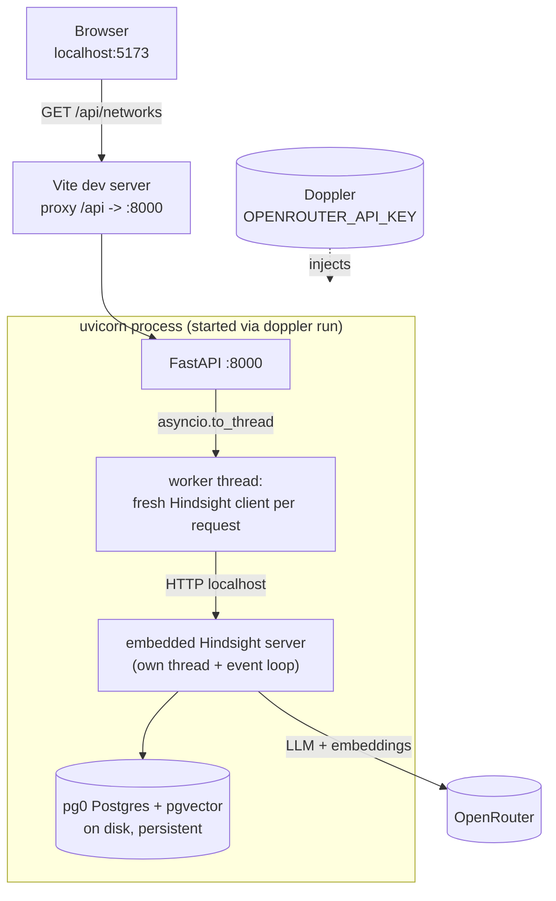
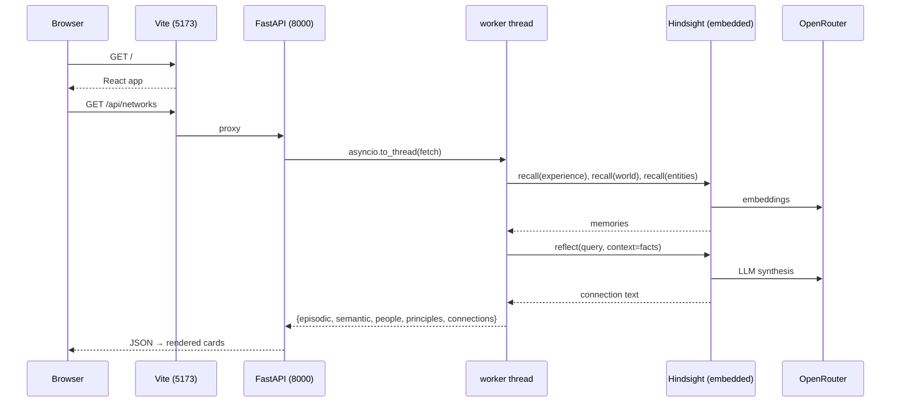

# Recall — Demo Design Doc

Scope: **this POC only** — ingest local iMessages, build memory networks with
embedded Hindsight, surface connections in a CLI and a web UI. Single user, one
machine, OpenRouter for inference. No multi-user, no photos/location, no
consolidation tuning.

---

## 1. What it does



Five stages, each a CLI subcommand; file-based state between them so every stage
is inspectable.

| Stage | Command | In → Out | Uses OpenRouter? |
|---|---|---|---|
| Ingest | `recall ingest --top-n N` | `chat.db` → `events.jsonl` | no |
| Episodes | `recall episodes` | `events.jsonl` → `episodes.jsonl` | no |
| Load | `recall load --limit N` | `episodes.jsonl` → Hindsight bank | **yes** (extraction) |
| Show | `recall show` | bank → terminal | **yes** (reflect) |
| Web | uvicorn + vite | bank → browser | **yes** (reflect) |

---

## 2. Schemas

### 2.1 `Event` — one message (canonical, source-agnostic)

`src/recall/schema.py`

| Field | Type | Notes |
|---|---|---|
| `id` | `str` | stable hash of (thread_id, date, is_from_me, content) |
| `t_utc` | `datetime` | tz-aware UTC |
| `author_role` | `str` | `"self"` or `"other"` |
| `content` | `str` | plain text |
| `thread_id` | `str` | chat identifier (phone / email / group guid) |
| `reply_to` | `str \| None` | `id` of replied-to event |
| `raw_ref` | `str` | `"chat.db#ROWID"` back-reference |
| `source` | `str` | `"imessage"` |

### 2.2 `Episode` — a contiguous run of events in one thread

| Field | Type | Notes |
|---|---|---|
| `id` | `str` | sha256(thread_id + first_event_id + t_start)[:16] |
| `thread_id` | `str` | |
| `t_start`, `t_end` | `datetime` | first / last event time |
| `participants` | `list[str]` | author roles present |
| `events` | `list[Event]` | ordered |

Both serialize to JSONL with ISO timestamps via `to_dict` / `from_dict`.

### 2.3 Hindsight `retain` payload (what one Episode becomes)

`src/recall/load.py`

```python
client.retain(
    bank_id="imessage-v0",
    content=<transcript: "me: …" / "{contact}: …" lines>,
    timestamp=episode.t_start.isoformat(),
    entities=[{"text": contact, "type": "person"}],
    tags=["imessage", contact],
    metadata={"thread_id": ..., "episode_id": ..., "n_events": "..."},
)
```

Hindsight then runs LLM extraction and stores the result across its four
networks (we don't define their schema — Hindsight owns it):

| Network | Hindsight backing | Surfaced by |
|---|---|---|
| Episodic (experiences) | `memory_units` `fact_type=experience` | `recall(types=["experience"])` |
| Semantic (world facts) | `memory_units` `fact_type=world` | `recall(types=["world"])` |
| People (entities) | `entities` table | `recall(include_entities=True)` |
| Principles (beliefs) | `mental_models` | `list_mental_models()` |
| Connection | — (synthesized) | `reflect(query=…)` |

---

## 3. How each stage works

### 3.1 Ingest (`ingest.py`)



- **Read-only**: `sqlite3.connect("file:...?mode=ro")` — never writes Messages.
- **Apple epoch**: `m.date` is nanoseconds since 2001-01-01 UTC → add `978307200`.
- **attributedBody**: ~99% of messages store text only in this BLOB; decoder
  anchors on the typedstream `NSString` marker and reads the length-prefixed
  UTF-8. Undecodable rows (attachment-only / system) are skipped (~0.14%).

### 3.2 Episodes (`episodes.py`)

Group events per thread, start a new episode whenever the gap between
consecutive messages **strictly exceeds** `gap_minutes` (default 30). Exact-30
stays together. Deterministic ids. (52,398 events → 3,544 episodes.)

### 3.3 Load (`load.py`)

One `retain` per episode (default `--limit` keeps it cheap; `--limit 0` = all).
Contact label derived from `thread_id` becomes the entity + tag. Oversized
transcripts capped at 12k chars (head+tail). Each retain triggers Hindsight's
LLM extraction via OpenRouter.

### 3.4 Show / Web (`show.py`, `poc_demo/`)

Query the four networks, then `reflect` for the connection. The reflect query is
fed pre-recalled episodic+semantic facts as context so the synthesis is
deterministic (the money shot).

---

## 4. Runtime architecture (web demo)



**Key design point — the event-loop boundary.** The embedded Hindsight server
runs on its own background thread/loop and is talked to over local HTTP. The
Hindsight *client* drives aiohttp on whatever loop first uses it. FastAPI async
handlers run on the server loop; sharing one client across that loop and worker
threads triggers `Timeout context manager should be used inside a task`. Fix: the
handler runs each request in `asyncio.to_thread` and builds a **fresh client in
that thread**, so the client's aiohttp session and its loop are born together —
mirroring the single-loop CLI.

---

## 5. Sequence: one page load



---

## 6. Boundaries (what this demo is *not*)

- **Principles** stay empty until enough episodes load for Hindsight's
  consolidation to form mental models — expected at small loads.
- Single source (iMessage), single user, single machine.
- Inference is **remote** (OpenRouter); local-model path is out of scope here.
- `reflect` on each `show` is the slow call (a live LLM synthesis), not an error.

---

## 7. File map

| Path | Role |
|---|---|
| `src/recall/schema.py` | `Event`, `Episode`, JSONL helpers |
| `src/recall/ingest.py` | chat.db → events |
| `src/recall/episodes.py` | temporal windowing |
| `src/recall/load.py` | episodes → Hindsight retain |
| `src/recall/show.py` | query 4 networks + reflect |
| `src/recall/hindsight_runtime.py` | boot embedded Hindsight (pg0 + OpenRouter) |
| `src/recall/cli.py` | `recall ingest\|episodes\|load\|show\|all` |
| `poc_demo/server/{app,data}.py` | FastAPI backend |
| `poc_demo/web/` | Vite + React + TS frontend |
