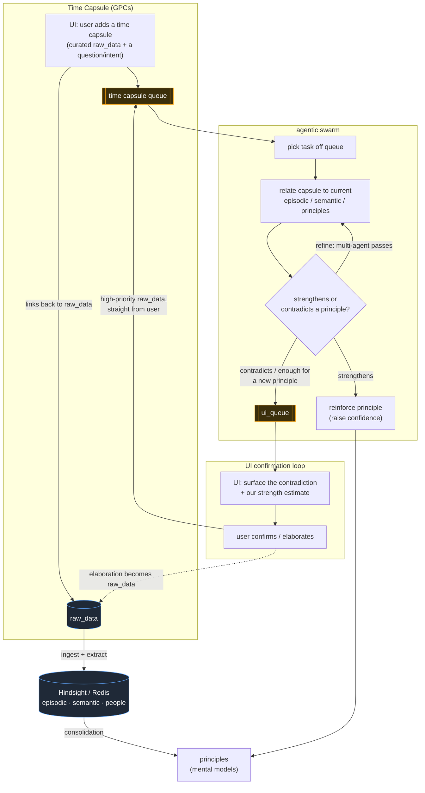
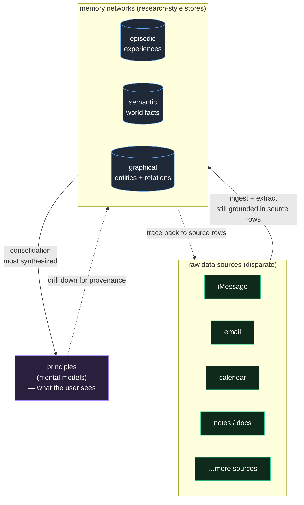
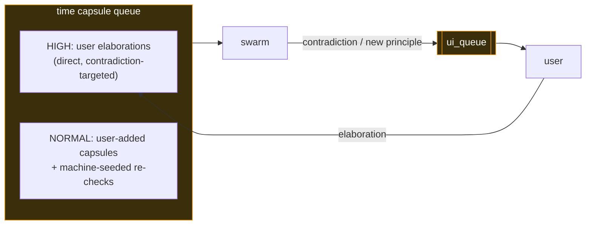
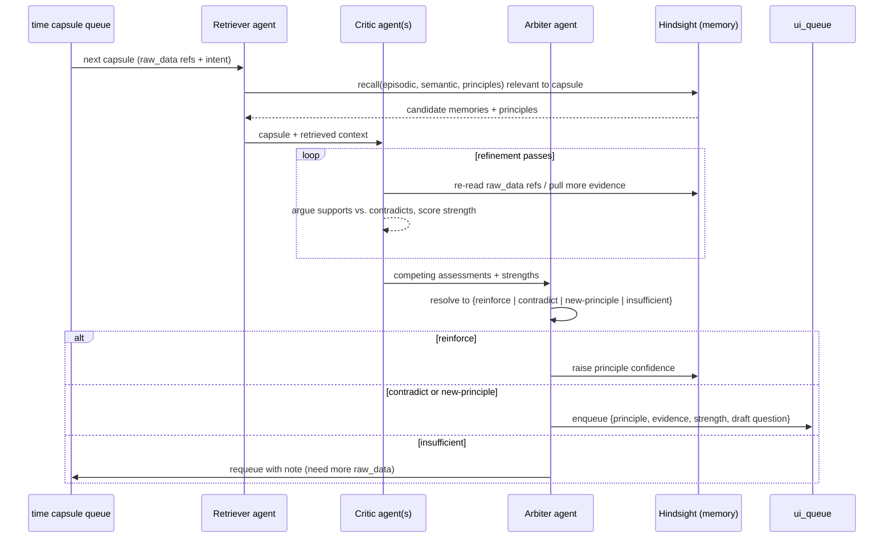
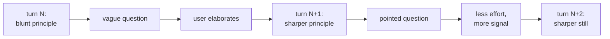

# Recall — Time Capsule Flywheel (design)

Scope: the **self-reinforcing loop** that turns raw data into principles, lets a
user inject "time capsules" (curated raw_data + intent), runs an agentic swarm to
test each capsule against existing memory, and routes any contradiction back to
the user for elaboration — whose answer becomes higher-priority raw_data. Builds
on the POC in [DEMO.md](DEMO.md); the four memory networks and Hindsight retain /
recall / reflect are reused, not redefined here.

The point of this doc: name the **flywheel**. Contradiction → user input → richer
data → sharper principles → better contradictions. Each turn makes the next turn
find a *more interesting* contradiction.

---

## 1. The flywheel (one picture)



**Why it's a flywheel, not a pipeline:** the user's elaboration in the last step
is not an endpoint — it re-enters as *higher-quality* raw_data (it's directly
authored, contradiction-targeted, and labeled). That sharpens the principles,
which makes the swarm's next contradiction detection more precise, which produces
a more pointed question for the user. Each loop spends less user effort for more
signal.

---

## 2. The synthesis ladder (raw sources → principles)

The original goal: take **disparate raw data sources** and fold them into the
kinds of memory current research argues an agent needs — episodic, semantic,
graphical — and then synthesize *those* up into **principles**, which is the only
layer the user actually reads. Each rung up is more synthesized and lossier about
specifics, but closer to "what does this person believe / how do they behave."



**Read it as three altitudes:**

| Altitude | What it is | How synthesized | Who reads it |
|---|---|---|---|
| **raw data sources** | the actual messages, emails, events | none — ground truth | machines (ingest) |
| **memory networks** | episodic / semantic / graphical | "very raw," but already synthesized *over* the source rows | the swarm |
| **principles** | mental models / beliefs | most synthesized, lossiest about specifics | the **user** |

**Why the dotted arrows down matter:** synthesis is one-way for *reading* (user
sees principles) but the links go back down for *grounding* — a principle can be
drilled into its supporting memories, and a memory back to the exact source rows.
That's what lets the swarm (§4) re-read raw_data instead of trusting a summary,
and what lets the UI show a user *why* a principle is held.

The memory networks here are exactly the four the POC already populates
(episodic, semantic, people/graphical, principles) — this ladder is the static
"where data lives," while §1 is the dynamic loop that keeps re-synthesizing it.

---

## 3. Vocabulary

| Term | Meaning |
|---|---|
| **raw_data** | Source records (iMessage events today; any source later). Already the input to the POC ingest. |
| **principle** | A consolidated belief = Hindsight **mental model**. The thing we test capsules against. |
| **time capsule (GPC)** | A user-curated bundle: a slice of raw_data + a question/intent ("does this still hold?", "I think X about myself"). Links *back* to raw_data so the swarm can re-read source, not just summaries. |
| **time capsule queue** | Work queue the swarm pulls from. Two priority bands: machine-seeded (normal) and user-elaboration (high). |
| **agentic swarm** | Multiple agents that relate a capsule to current memory, run refinement passes, and decide reinforce vs. contradict. |
| **ui_queue** | Output queue of contradictions / candidate new principles awaiting user confirmation. |
| **strength** | The swarm's estimate of how strongly a capsule contradicts (or supports) a principle — drives both UI ordering and how we phrase the question. |

---

## 4. The two queues (the flywheel's bearings)



- **Why two priority bands:** a user actively answering a contradiction is the
  scarcest, richest signal in the system. It jumps the line so the swarm closes
  *that* loop before chewing on background re-checks.
- The queues are the only coupling between subsystems — UI, swarm, and memory
  never call each other directly. Keeps each independently restartable and makes
  state inspectable (matches the POC's file-based-state philosophy).

---

## 5. Inside the swarm — refinement, not one shot



- **Retriever** grounds the capsule in current memory (reuses POC `recall`).
- **Critic(s)** run the *refinement phases* — multiple passes / multiple agents
  so a weak coincidence doesn't get promoted to a contradiction. They can follow
  the capsule's links back to raw_data instead of trusting a summary.
- **Arbiter** makes one decision and is the only writer: it either reinforces a
  principle in place or hands a contradiction to `ui_queue`. "Insufficient"
  requeues rather than guessing — failing safe, not loud.

---

## 6. State / data shapes (additive to the POC)

Reuses POC `Event`, `Episode`, and Hindsight networks. New objects:

### 5.1 `TimeCapsule`
| Field | Type | Notes |
|---|---|---|
| `id` | `str` | stable hash(user_id + created_at + intent) |
| `created_at` | `datetime` | tz-aware UTC |
| `author` | `str` | `"user"` or `"system"` (machine-seeded re-check) |
| `intent` | `str` | the question / claim driving the capsule |
| `raw_refs` | `list[str]` | back-refs into raw_data (e.g. `chat.db#ROWID`, episode ids) |
| `priority` | `str` | `"high"` (user elaboration) or `"normal"` |
| `parent_contradiction` | `str \| None` | id of the contradiction this answers (closes a loop) |

### 5.2 `Contradiction` (a `ui_queue` item)
| Field | Type | Notes |
|---|---|---|
| `id` | `str` | |
| `principle_id` | `str` | Hindsight mental_model id under test |
| `verdict` | `str` | `"contradict"` or `"new-principle"` |
| `strength` | `float` | 0–1, swarm's confidence |
| `evidence` | `list[str]` | capsule + raw_data refs that triggered it |
| `draft_question` | `str` | what the UI asks the user |
| `status` | `str` | `"pending" / "confirmed" / "dismissed"` |

A confirmed/elaborated `Contradiction` spawns a new `TimeCapsule` with
`priority="high"` and `parent_contradiction=<this id>` — the link that makes the
loop a loop.

---

## 7. Why this compounds (the payoff)



- Each elaboration is **labeled, targeted raw_data** — worth more per token than
  bulk ingest.
- Principles get **confidence + provenance**, so reinforcement and contradiction
  are measurable, not vibes.
- The system asks the user **fewer, better** questions over time instead of more.

---

## 8. Boundaries / open questions

- **Not in the POC yet** — this doc is the target architecture; the POC
  (DEMO.md) stops at "load → show 4 networks + reflect".
- Principles only emerge once Hindsight consolidation has enough episodes
  (same caveat as the POC). The flywheel can't spin on an empty bank.
- Open: dedup of near-identical contradictions; backpressure if the user never
  answers `ui_queue`; how `strength` thresholds map to "ask now" vs. "batch."
- Open: whether machine-seeded re-checks run on a schedule or are triggered by
  new raw_data crossing a principle's evidence set.
```
