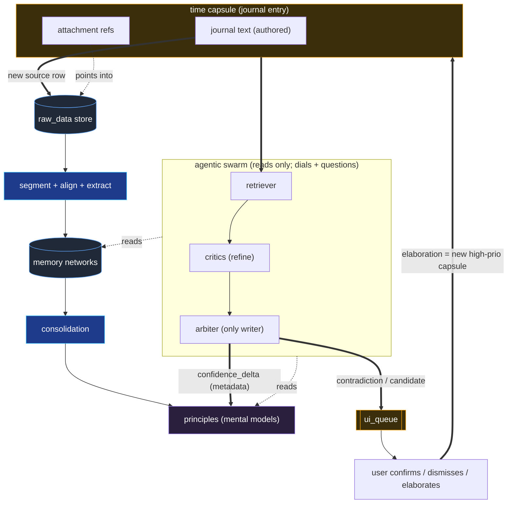
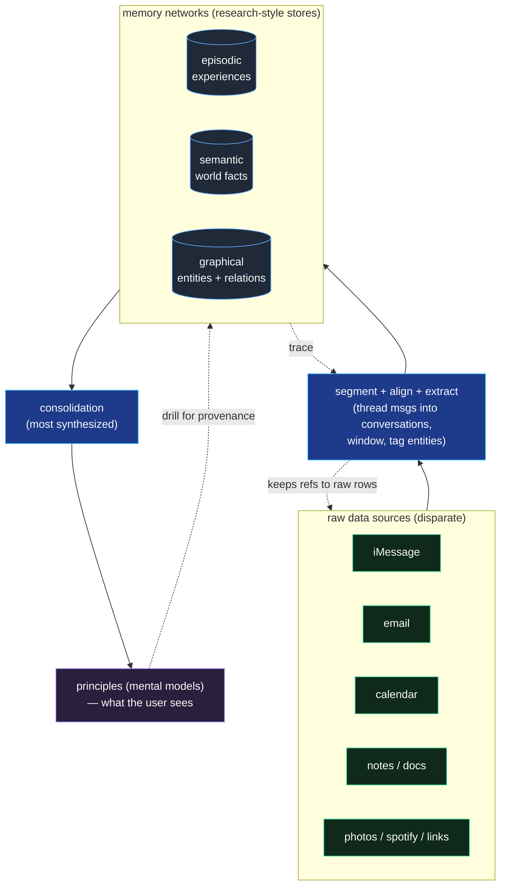
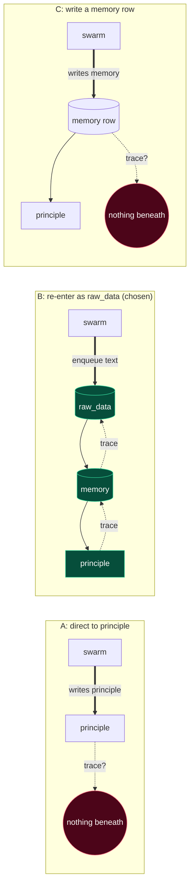
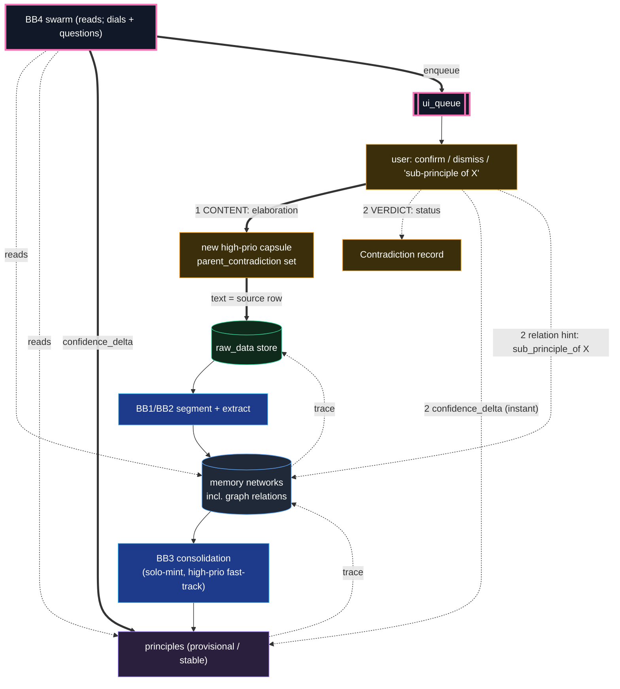
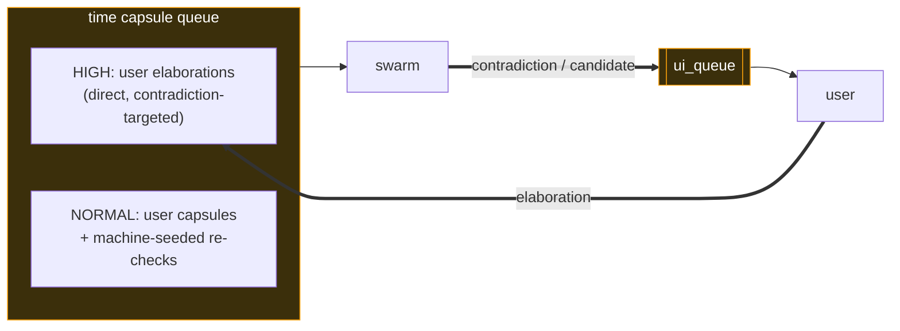
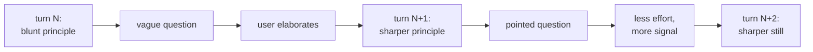

# Recall — Time Capsule Flywheel (design)

Scope: the **self-reinforcing loop** that turns raw data into principles, lets a
user inject "time capsules" (journal text + curated raw_data refs), runs an
agentic swarm to test each capsule against existing memory, and routes any
contradiction back to the user for elaboration — whose answer becomes
higher-priority raw_data. Builds on the POC in [DEMO.md](DEMO.md); the four memory
networks and Hindsight retain / recall / reflect are reused, not redefined here.

The point of this doc: name the **flywheel** and pin down the one rule that keeps
it honest. Contradiction → user input → richer data → sharper principles → better
contradictions. Each turn makes the next turn find a *more interesting*
contradiction.

**The load-bearing invariant (read this first):** the swarm **never writes
principles**. Principles are only ever born or changed by *consolidation* reading
*raw_data* up through memory. The swarm is a reader and a router — its only writes
are a confidence dial and a question for the user. Everything below is a
consequence of that one rule. See [§4](#4-the-core-invariant-the-swarm-never-writes-principles).

---

## 1. The flywheel (one picture)



**Why it's a flywheel, not a pipeline:** the user's elaboration in the last step
is not an endpoint — it re-enters as a *higher-quality* capsule (directly authored,
contradiction-targeted, labeled). The loop's output has the same shape as its
input, only richer. That sharpens the principles, which makes the swarm's next
contradiction detection more precise, which produces a more pointed question. Each
loop spends less user effort for more signal.

---

## 2. The synthesis ladder (raw sources → principles)

Take **disparate raw data sources** and fold them into the kinds of memory current
research argues an agent needs — episodic, semantic, graphical — and then
synthesize *those* up into **principles**, the only layer the user actually reads.
Each rung up is more synthesized and lossier about specifics, but closer to "what
does this person believe / how do they behave."



**Read it as three altitudes:**

| Altitude | What it is | How synthesized | Who reads it |
|---|---|---|---|
| **raw data sources** | the actual messages, emails, events, journal text | none — ground truth | machines (ingest) |
| **memory networks** | episodic / semantic / graphical | "very raw," but already synthesized *over* the source rows | the swarm |
| **principles** | mental models / beliefs | most synthesized, lossiest about specifics | the **user** |

**Provenance is a property of the path, not a field you stamp on.** A principle is
traceable *because* it was consolidated from memories that were extracted from
source rows, each step leaving a link. There is no "attach provenance" operation —
only "did this thing rise through the pipeline or not." This is the single fact
that decides everything in [§5](#5-where-confirmed-output-lands-a--b--c).

**The intermediary step is real, not an arrow.** Memory does not read raw rows
directly. Between them sits segmentation/alignment: threading loose messages into
conversations, windowing by time, tagging entities — "give memory the data in a
form it can use." Its one hard rule: the segmented unit must keep refs back to the
raw rows it was built from, or the provenance chain snaps at exactly the step that
reshapes the most. See the black boxes in [§6](#6-the-four-black-boxes).

---

## 3. What a time capsule is (the journal model)

A time capsule is a **journal entry** — think Apple Journal: you write free text and
attach artifacts (photos, iMessage threads, Spotify songs). It is a **durable,
referenceable node**, not a transient input: principles and memories can cite a
capsule as evidence, and the user can look back on it.

It is a **composite** of two parts with *different provenance behavior*:

- **journal text** — new, user-authored content. This is **new raw_data**, and its
  provenance *terminates at the user*. That is not a weak link: a diary is the
  textbook **primary source** — first-person testimony, the strongest grounding
  that exists for a belief about oneself. There is no gap beneath it to apologize
  for.
- **attachment refs** — pointers into raw_data that *already exists* and has its own
  provenance.

So a principle built from a capsule traces cleanly to the user's own words
(terminal) plus the linked artifacts (each tracing to its origin). Fully grounded.

**Keep the capsule as a container; do not melt it into raw_data.** It *births* one
raw_data row (its text) and *references* N others (attachments), and additionally
carries intent / moment / priority / `parent_contradiction`. The text is the
*fact*; the capsule is the *curation around* the fact. Collapsing them loses the
grouping that lets the swarm treat "these 5 photos + my reflection on them" as a
single unit of meaning.

---

## 4. The core invariant: the swarm never writes principles

The swarm reads everything and writes almost nothing. It has exactly **two write
channels**, and neither creates structure:

1. **`confidence_delta`** — a metadata write on an *existing* principle.
2. **enqueue** — a `Contradiction` / candidate onto `ui_queue` (a question for the
   user).

That's it. New principles are minted **only** by consolidation, **only** from
raw_data. The reason is the provenance fact from [§2](#2-the-synthesis-ladder-raw-sources--principles):
a principle written by anything other than the rise-through-the-pipeline has
nothing traceable beneath it, and a second writer to `PRIN` turns the trace
invariant from "holds by construction" into "holds if the writer remembers to" —
which rots.

**The content / metadata split is the whole trick.** Two questions get answered by
two different mechanisms:

| Question | Nature | Mechanism | Latency |
|---|---|---|---|
| *What is the belief?* | content | always rides the pipeline (raw_data → memory → consolidation) | slow, honest |
| *How sure / how fast?* | metadata | `confidence_delta` written directly to the principle | instant |

This is why responsiveness and provenance don't fight: the dial moves now, the
belief catches up through the one path. The swarm is effectively stateless with
respect to the knowledge graph — it never owns structure, so it can be restarted,
re-run, and raced against the pipeline without corrupting anything (its writes are
idempotent dials and re-queueable questions).

---

## 5. Where confirmed output lands: A / B / C

The only genuinely open question was: when a contradiction resolves into a *new*
belief, where is that belief born? Three options; we chose **B**.

**A — write straight to principles.** Fastest, but the principle lands with nothing
beneath it. To make it traceable the swarm must fabricate the downward links —
reimplementing extract + consolidate inline — i.e. **duplicate the pipeline** as a
second write-path. Only honest if you deliberately accept a separate class of
"user-authored, source-is-the-assertion" principles. Rejected.

**B — re-enter as raw_data (chosen).** The authored content becomes a high-priority
raw_data row and rises through the one pipeline. The swarm writes nothing it has to
trace (it writes at the bottom, where there is nothing below to link to). One code
path, provenance intact, zero duplication. Cost: latency + the empty-bank problem,
addressed by the **solo-mint provisional** rule in [§6](#6-the-four-black-boxes)
and the instant `confidence_delta` for the metadata half.

**C — write a memory row, let consolidation lift it.** Looks like a compromise; is
the worst. The principle now traces down to a memory row that itself traces to
nothing — the provenance gap just moved down one rung, still a second write-path,
still consolidation latency. Rejected.



**Rule of thumb that falls out:** the swarm is a reader and a router, never a
writer above raw_data. A and C both break that; B respects it.

---

## 6. The four black boxes

"raw → principles" is not one arrow. It is at least four non-trivial subsystems,
each worth designing on its own:

| Box | Job | Hard part |
|---|---|---|
| **BB1 — segment / align** | raw rows → memory-ready units (thread messages into conversations, window by time) | must keep refs back to raw rows or provenance snaps |
| **BB2 — extract** | units → episodic / semantic / graph entries (often folded into BB1) | entity resolution, dedup across sources |
| **BB3 — consolidation** | memory → principles | the **solo-mint + decay** policy below |
| **BB4 — the swarm** | relate a capsule to memory, decide reinforce / contradict / candidate | refinement passes so a coincidence is not promoted |

**BB3's solo-mint + decay policy** is what makes B work without lag:

- An **authored first-person assertion** is sufficient to mint a **provisional**
  principle on its own (the diary-as-primary-source argument). Bulk behavioral data
  still needs corroboration before it mints anything.
- A provisional principle **decays** unless later data reinforces it — so a one-off
  vent ("I hate everyone today") does not become a permanent mental model.
- Provisional → **stable** only after independent corroboration (ideally from
  *behavior*, not just more assertions). See [§9](#9-principles-provisional--stable-versioned-behavior-tested).

---

## 7. Inside the swarm — refinement, not one shot

```mermaid
sequenceDiagram
    participant Q as time capsule queue
    participant R as Retriever agent
    participant C as Critic agent(s)
    participant A as Arbiter agent
    participant M as Hindsight (memory)
    participant UQ as ui_queue

    Q->>R: next capsule (journal text + attachment refs + intent)
    R->>M: recall(episodic, semantic, principles) relevant to capsule
    M-->>R: candidate memories + principles
    R->>C: capsule + retrieved context
    loop refinement passes
        C->>M: re-read raw_data refs / pull more evidence
        C-->>C: argue supports vs. contradicts, score strength
    end
    C->>A: competing assessments + strengths
    A->>A: resolve to {reinforce | contradict | candidate | insufficient}
    alt reinforce
        A->>M: confidence_delta (+)  on existing principle
    else contradict
        A->>M: confidence_delta (-) + mark contested
        A->>UQ: enqueue {principle, evidence, strength, draft question}
    else candidate (looks like a new belief)
        A->>UQ: enqueue {candidate, evidence, draft question}
        Note over A,UQ: arbiter writes NO principle; text is already raw_data
    else insufficient
        A->>Q: requeue with note (need more raw_data)
    end
```

- **Retriever** grounds the capsule in current memory (reuses POC `recall`).
- **Critic(s)** run the refinement phases — multiple passes / agents so a weak
  coincidence is not promoted. They follow the capsule's links back to raw_data
  instead of trusting a summary.
- **Arbiter** is the only writer, and even it only turns the confidence dial or
  posts to `ui_queue`. It never mints a principle — that is consolidation's job.
  "Insufficient" requeues rather than guessing: fail safe, not loud.

---

## 8. Closing the loop: the ui_queue answer

When the user answers a `ui_queue` item — "yes, this is a new sub-principle of X,"
or "no, this doesn't contradict, that was a one-off" — that single action splits
into **two payloads**, the same content/metadata split as everywhere else:

- **Content** → the elaboration text becomes a **new high-priority capsule**
  (`priority="high"`, `parent_contradiction=<id>`). Its text lands in raw_data and
  rides the pipeline. *This is the only thing that creates or changes a belief.*
- **Verdict** → resolves the `Contradiction` record (`confirmed` / `dismissed`),
  writes an immediate `confidence_delta`, and — for "sub-principle of X" — drops a
  **relation hint** (`sub_principle_of -> X`) into the **graph** memory telling
  consolidation where to attach the new principle.



**User directness changes dials, never the path.** "Yes, it's a new principle" is
the moment you will be tempted to write straight to `PRIN` — that is option A in
disguise, wearing the user's authority. Resist it: the user's word does not change
provenance physics, and a direct write would also risk a *duplicate* once
consolidation mints from the same text. Instead, directness raises three dials —
**priority, confidence, immediacy** — so the principle is born near-instantly via
the fast-tracked pipeline. It *feels* direct; it still goes through the one birth
canal.

**Dismissals teach, they don't just silence.** "No, that was a one-off" sets the
contradiction to `dismissed`, un-contests the principle, and `+δ`s it (the user
defended it). Critically, the *reasoning text* is still content → raw_data →
memory, so next time the swarm sees similar data it has the user's explanation and
won't re-raise the same contradiction. That is the [§13](#13-open-questions--boundaries)
dedup problem getting solved as a side effect.

---

## 9. Principles: provisional → stable, versioned, behavior-tested

- **Append-only history.** Each principle keeps a list of `{state, cause,
  timestamp}`; current state = latest. This is the `confidence_delta` ledger
  extended from the number to the content, and it answers "what did I believe in
  2019 and why did it change" without diffing global snapshots. Cheap now, painful
  to retrofit. (Deferred nicety: a tag distinguishing *corrected* — "I was wrong" —
  from *evolved* — "I changed.")
- **Provisional until behavior-tested.** Even a principle the user *declares*
  ("I value deep friendships") starts provisional and is treated as a **hypothesis
  the system keeps testing against behavior** (actual message patterns). Behavior
  corroborates → promote to stable. Behavior contradicts → that is the next,
  sharper contradiction. A declaration skips the queue, not the scrutiny — this is
  the flywheel eating its own tail productively.

---

## 10. Vocabulary

| Term | Meaning |
|---|---|
| **raw_data** | Source records: iMessage / email / calendar / media events, **and** capsule journal text. Ground truth; the input to ingest. |
| **time capsule** | A durable journal entry: authored **text** (new raw_data) + **attachment refs** (pointers to existing raw_data) + intent / priority / `parent_contradiction`. A first-class evidence node. |
| **principle** | A consolidated belief = Hindsight **mental model**. Provisional or stable; versioned; the thing capsules are tested against. |
| **confidence_delta** | A metadata write nudging a principle's confidence scalar (0–1). Reversible, idempotent, needs no provenance — it adjusts certainty about an already-grounded belief, not the belief. |
| **agentic swarm** | Retriever + Critics + Arbiter. Reads memory/principles, runs refinement passes, decides reinforce / contradict / candidate. **Writes only dials + questions.** |
| **ui_queue** | Output queue of contradictions / candidates awaiting user confirmation. |
| **strength** | The swarm's estimate of how strongly a capsule contradicts / supports a principle. Drives UI ordering and maps onto `confidence_delta`. |
| **solo-mint** | Consolidation rule: a first-person authored assertion may mint a *provisional* principle alone; bulk data needs corroboration. |

---

## 11. State / data shapes (additive to the POC)

Reuses POC `Event`, `Episode`, and Hindsight networks. Updated / new objects:

### 11.1 `TimeCapsule`
| Field | Type | Notes |
|---|---|---|
| `id` | `str` | stable hash(user_id + created_at + intent) |
| `created_at` | `datetime` | tz-aware UTC |
| `author` | `str` | `"user"` or `"system"` (machine-seeded re-check) |
| `journal_text` | `str` | authored prose; ingested as a raw_data source row |
| `intent` | `str \| None` | the question / claim driving the capsule |
| `attachment_refs` | `list[str]` | refs to existing raw_data (`chat.db#ROWID`, episode ids, media ids) |
| `priority` | `str` | `"high"` (user elaboration) or `"normal"` |
| `parent_contradiction` | `str \| None` | id of the contradiction this answers (closes a loop) |

### 11.2 `Contradiction` (a `ui_queue` item)
| Field | Type | Notes |
|---|---|---|
| `id` | `str` | |
| `principle_id` | `str \| None` | mental_model under test (None for a fresh candidate) |
| `verdict` | `str` | `"contradict"` or `"candidate"` |
| `strength` | `float` | 0–1, swarm's confidence |
| `evidence` | `list[str]` | capsule + raw_data refs that triggered it |
| `draft_question` | `str` | what the UI asks the user |
| `status` | `str` | `"pending" / "confirmed" / "dismissed"` |
| `relation_hint` | `str \| None` | e.g. `sub_principle_of:<principle_id>` from the user's answer |

A confirmed/elaborated `Contradiction` spawns a new `TimeCapsule` with
`priority="high"` and `parent_contradiction=<this id>` — the link that makes the
loop a loop.

### 11.3 `Principle` (extends Hindsight mental_model)
| Field | Type | Notes |
|---|---|---|
| `id` | `str` | |
| `state` | `str` | `"provisional"` or `"stable"` |
| `confidence` | `float` | 0–1, = sum of the delta ledger |
| `history` | `list[{state, cause, timestamp}]` | append-only; `cause` refs the capsule/evidence that drove the change |
| `relations` | `list[str]` | graph edges, e.g. `sub_principle_of:<id>` |

---

## 12. The two queues (the flywheel's bearings)



- **Why two priority bands:** a user actively answering a contradiction is the
  scarcest, richest signal in the system. It jumps the line so the swarm closes
  *that* loop before chewing on background re-checks.
- The queues are the only coupling between subsystems — UI, swarm, and the pipeline
  never call each other directly. Keeps each independently restartable and state
  inspectable (matches the POC's file-based-state philosophy).

---

## 13. Why this compounds (the payoff)



- Each elaboration is **labeled, targeted raw_data** — worth more per token than
  bulk ingest.
- Principles carry **confidence + provenance + history**, so reinforcement and
  contradiction are measurable, not vibes.
- The system asks the user **fewer, better** questions over time.

---

## 14. Open questions / boundaries

- **Not in the POC yet** — this doc is the target architecture; the POC (DEMO.md)
  stops at "load → show 4 networks + reflect."
- **Double-counting / idempotency.** The capsule text is raw_data *and* the swarm
  reads the capsule. One assertion must be one evidence unit — don't let a
  consolidation mint *and* a swarm `+δ` both fire off the same sentence and inflate
  confidence as if two sources agreed. Needs an idempotency key per assertion.
- **Eventual consistency between the two processes.** The swarm scores against
  principles as they exist at time T; the pipeline may rewrite them at T+1. Safe
  *only because* the swarm's writes are idempotent dials and "insufficient"
  requeues — never structural. Build it that way or the race corrupts state.
- **Solo-mint thresholds + decay rates.** How fast does an un-reinforced
  provisional principle decay? What counts as "behavioral corroboration" for
  promotion to stable?
- **Dedup + backpressure** (now partly addressed by dismissal-as-evidence): merging
  near-identical contradictions; what happens when the user never answers
  `ui_queue`.
- **Segmentation provenance.** BB1 reshapes the most data; its refs back to raw rows
  are the most fragile link in the whole chain.
- **Machine-seeded re-checks:** on a schedule, or triggered by new raw_data crossing
  a principle's evidence set?
