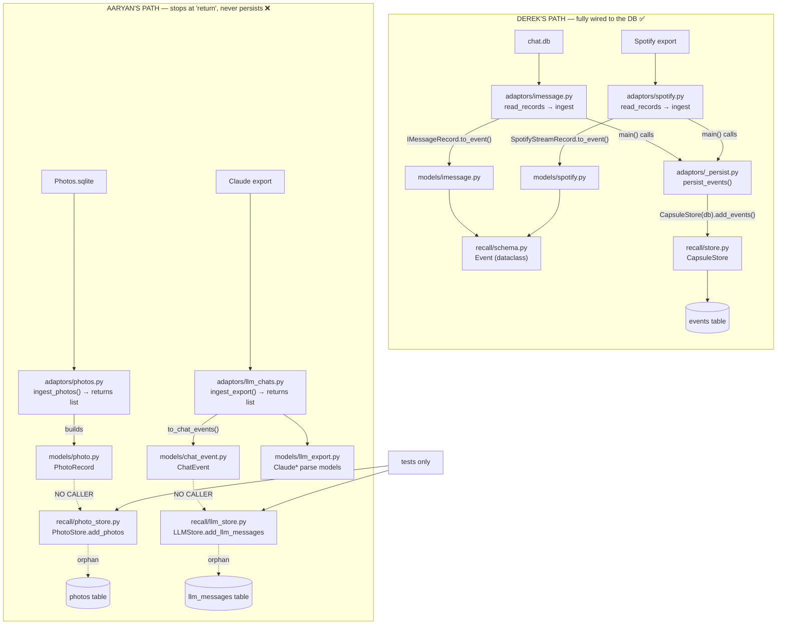

Now I have the complete, verified call graph. The findings are sharper than the earlier review suggested: Aaryan's stores and photo/Claude persistence are **completely unwired** — only Derek's path actually reaches the database.

Here's the exact map of how the files call each other.

## The verified call graph

## What the trace actually proves

**Derek's path is the only one that reaches the database.**
- `adaptors/imessage.py:270` and `adaptors/spotify.py:143` — their `main()` calls `persist_events(events)`.
- `adaptors/_persist.py:43` — `persist_events` does `CapsuleStore(db_path).add_events(events)`.
- So both his sources write to the **`events` table in `store.py`**, going through `models/imessage.py` / `models/spotify.py` → `.to_event()` → the `Event` dataclass in `schema.py`.

**Aaryan's path never writes anything.**
- `adaptors/photos.py` has `ingest_photos()` that **returns a `list[PhotoRecord]` and stops** — no `main()`, no store call (grep: "NO main() in either").
- `adaptors/llm_chats.py` has `ingest_export()` that **returns `list[ChatEvent]` and stops** — same.
- `recall/llm_store.py` (`LLMStore.add_llm_messages`) and `recall/photo_store.py` (`PhotoStore.add_photos`) have **zero callers in `src/`** — only the tests `test_llm_store.py` / `test_photo_store.py` instantiate them.

So `llm_messages` and `photos` tables only ever get created/written **inside tests**. In a real run, Aaryan's data goes nowhere.

## Three concrete things this changes about the merge

1. **You're not actually choosing between two live storage paths.** Only Derek's `store.py`/`_persist.py` path runs. `LLMStore`/`PhotoStore` are dead code with tests. That makes your instinct ("whatever Derek uses") the path of least resistance — his wiring already works; Aaryan's needs to be connected regardless.

2. **The reconciliation is mostly "point Aaryan's adapters at Derek's path,"** not "merge three live stores." Concretely:
   - `llm_chats.py` should emit `Event` (not `ChatEvent`) and call `persist_events()` → deletes `llm_store.py` and `models/chat_event.py` entirely.
   - `photos.py` needs a `.to_event()` (with `additional_data`) + a `persist_events()` call → folds `photo_store.py` into the single `events` table.

3. **On your `src/recall` concern:** Derek's adapters import from `recall.schema` (the `Event` dataclass) and `recall.store` (`CapsuleStore`) — so his "models in `src/models`, writes via a different file" really means: models in `src/models/`, the canonical `Event` + the store live in `src/recall/`, and `_persist.py` (in `src/adaptors/`) is the thin bridge. He didn't avoid `recall/` — he reused `recall.store.CapsuleStore` through `_persist`. If you want to keep `src/recall` as the untouched POC demo, the bridge would need to move (e.g. a new `src/store/` the adapters own), but **right now everything funnels through `recall.store.CapsuleStore`.**

Want me to:
- **(a)** record these two TODO resolutions (Option A; Spotify row = `WHERE type='spotify'`) and the "Aaryan's path is unwired" finding into the doc, and/or
- **(b)** draft the reconciliation as a step-by-step plan (point both Aaryan adapters at the single `events` table, delete the two orphan stores + `ChatEvent`)?
