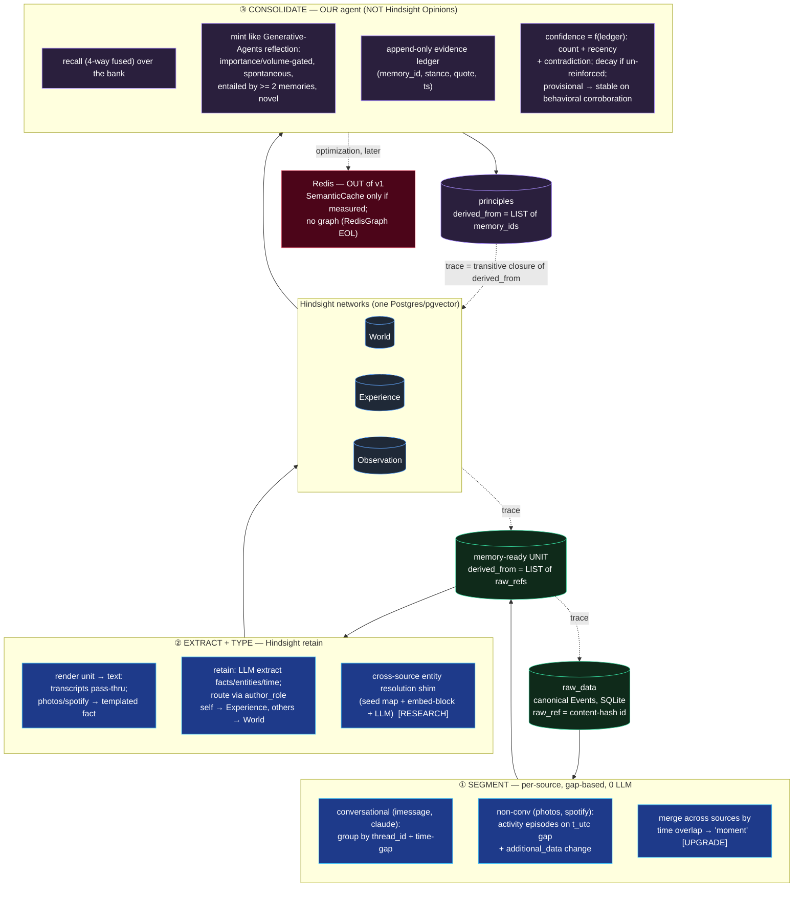

# Raw data → principles — research

Scope: the **vertical only** — how a raw row becomes a principle, every rung in
between, and what the research says runs each one. Ignores the flywheel / swarm /
ui_queue ([Time Capsule Flywheel](TIME_CAPSULE_FLYWHEEL.md) covers those). Sources
are web + paper research (June 2026); citations inline per rung.

**Everything after raw_data is treated as an open research problem.** No rung here
is "built" — existing code is at most one prior attempt, not a decision. The
canonical `Event` (`id, t_utc, author_role, content, thread_id, reply_to, raw_ref,
source, additional_data`) is the only fixed input.

---

## 0. The stitched pipeline

**One line:** raw Events → gap-segment per source → render to text + Hindsight
`retain` → World / Experience / Observation → **our reflection-tree agent** recalls
and mints principles with an evidence ledger → principles. Provenance is the
transitive closure of `derived_from` lists carried at every arrow; an empty list is
rejected at write time.

**The split that resolves the whole confusion:** Hindsight owns ② + recall (extract,
store, retrieve). **We own ③** (the principle rung), built on Generative Agents, not
Hindsight's Opinion layer. Redis sits off the path, out of v1.

---

## 1. Rung ① — Segmentation (raw rows → memory-ready units)

A "unit" is whatever we hand to one `retain` call. A lone low-context row ("yeah
lol") extracts to nothing; coherent units extract well — so segmentation is what
makes extraction *mean* anything, not an optimization.

**Finding.** Four strategy families: fixed time-window, **inactivity-gap
sessionization**, topic/semantic (TextTiling → embedding-drift → supervised),
hybrid. Don't reach for semantic chunking first — Vectara (NAACL 2025 Findings)
found cheap chunking matches or beats embedding-based semantic chunking on realistic
data. Heterogeneous/non-conversational events have a home too: Event Segmentation
Theory and lifelogging (MyLifeBits, NTCIR-Lifelog) segment multimodal streams on
*feature change* (space / actors / time), exactly analogous to a topic shift.

| Strategy | LLM cost | Unit quality | Provenance difficulty |
|---|---|---|---|
| Fixed time-window | 0 | low — arbitrary cuts | trivial |
| **Inactivity-gap sessionization** | **0** | **medium–high** | **trivial (contiguous run)** |
| Topic — embedding-drift | 1 embed/row | higher on mixed streams | easy (boundaries between rows) |
| Topic — supervised disentanglement | high | highest for interleaved group chat | medium (non-contiguous) |

**What other tools do:** none auto-segment by topic. mem0 retains per message-*pair*;
Graphiti makes the *developer* choose the episode boundary; Letta segments by
context-window pressure; LangMem's background mode is effectively gap-triggered. So
explicit sessionization is a defensible differentiator, not over-engineering.

**Recommendation (v1 default).** Per-source gap sessionization, **zero LLM**:
- conversational (imessage, claude): group by `thread_id`, order by `t_utc`, cut on
  gap > T (start 30 min; 60 min is better-justified for personal streams — tunable;
  optionally fit a 2-component GMM to log inter-event times and split at the valley).
  Cap unit token size + wall-clock span.
- non-conversational (photos, spotify): per-source activity episodes on `t_utc` gap,
  boundary also triggered by change in key `additional_data` (geo/people; artist/album).
- a unit = `{unit_id, source, ordered raw_ref list, t_start, t_end}`.

**The iMessage-vs-other framing dies here:** it's "segment each source on its own
change signal," not "thread iMessages." Cross-source "moment" merging (align
photo+spotify+chat by time overlap) is attractive but adds provenance bookkeeping —
defer to v2.

**Open question / upgrade experiment.** Does topic-aware sub-segmentation beat a dumb
gap, enough to justify cost + provenance complexity? Hold downstream constant; for
sample sessions run `retain` on (A) whole gap-session vs (B) embedding-drift
sub-split; measure facts/unit, extraction precision (hallucinated vs grounded),
retrieval hit-rate, against token + embed cost. Upgrade only if B's gain survives the
cost (Vectara is the prior that it often won't). Group-chat interleaving is the
likely failure mode that would justify supervised disentanglement.

*Sources:* Vectara "Is Semantic Chunking Worth the Cost?" arXiv 2410.13070 (NAACL
2025); Hearst TextTiling 1997; Halfaker et al. WWW 2015 (1-hr cutoff); Kurby & Zacks
*TiCS* 2008 (Event Segmentation Theory); Doherty & Smeaton 2007 + NTCIR-12 Lifelog
(multimodal events); mem0 2504.19413; Graphiti 2501.13956; LangMem (LangChain 2025).

---

## 2. Rung ② — Extraction & typing (units → typed memories)

**Finding.** Hindsight `retain` (arXiv 2512.12818, §4.1) is a strong fit but has
three gaps for this schema: input is **conversation-level** (rung ① supplies that),
it is **text-only** (no image/multimodal method), and dedup is **within-bank only**
(`ρ(m) = argmax_e [α·sim_str + β·sim_co + γ·sim_temp]` — won't merge a handle with a
photo people-tag). It extracts **2–5 narrative facts per conversation**, each
self-contained, routed into World (objective) / Experience (first-person) /
Observation (per-entity summary `SummarizeLLM(F_e)`).

**Multimodal → fact:** the dominant 2025 pattern is *convert to text, then run the one
text pipeline*. Where structure exists (spotify play, photo metadata), a **templated
fact from `additional_data`** ("On {t_utc}, listened to {track} by {artist}") is
cheaper and more reliable than VLM captioning — caption hallucination propagates into
stored "facts." Reserve VLM captioning for genuinely unstructured pixels.

**Entity resolution across sources:** standard pipeline is blocking → matching →
canonicalization; embedding-based blocking + LLM confirm is the pragmatic 2025 move.
Hindsight's within-bank resolver is insufficient for cross-source identity.

**Recommendation (v1).** Lean on `retain`, wrap with: (a) a unit→text renderer
(transcripts pass through; photos/spotify → templated facts); (b) pass `author_role`
explicitly so self→Experience / others→World routes correctly (Hindsight leaves
multi-participant routing implicit); (c) a light cross-source entity shim (seed
identity map + embedding-block + LLM-confirm) around the built-in resolver.

**Open research question (a novel bit).** *Provenance-preserving cross-source,
cross-modal entity canonicalization* — unifying the same person/place across an
imessage handle, a photo people-tag, a Claude mention, a spotify artist, while
keeping lineage and feeding clean canonical entities into Observation summaries.

*Sources:* Hindsight 2512.12818 §4.1.1–4.1.5; mem0 2504.19413; Graphiti 2501.13956
(bi-temporal, episode back-edges); Cognee 2505.24478 (ontology-grounded dedup);
OmniMem 2604.01007 (modality → unified text); "Rise of Semantic Entity Resolution"
(2026). *Uncertainty:* Hindsight section/equation IDs from rendered HTML — verify
against PDF before formal citation; no ablations exist, so its weaknesses are
inferred from design + absence of a Limitations section.

---

## 3. Rung ③ — Consolidation → principles (the rung we own)

This is the decision the whole doc turns on. Two options: (a) use Hindsight's
built-in `reflect` / Opinion layer; (b) build our own external agent that reads
memories via `recall` and mints principles with our own prompt + policy.

**Finding — build (b).** Hindsight's Opinions are structurally wrong for our goal on
two counts (paper §5.4–5.6):
- **Formation is query-driven.** An Opinion is minted only inside `Reflect(B,Q,Θ)`,
  triggered by a query asking for a subjective judgment — never spontaneously
  consolidated from the bank. (Correction to earlier framing: reinforcement *does*
  run in background, but on the **retain** path, and only to *nudge confidence on
  existing* beliefs via Eq. 26 `c' = min(c+α,1)` / `max(c−α,0)` / `max(c−2α,0)` — it
  never mints.)
- **Weak provenance.** Opinions are standalone tuples `(t,c,τ,b,E)`; the link to
  source facts is re-derived at reinforcement time by entity/embedding match, not
  stored. No evidence list, no proof refs, no quotes. No lifecycle states, no decay.

**The right template is Generative Agents' reflection tree** (Park et al., UIST '23):
spontaneously synthesizes net-new self-beliefs from accumulated memories
(**importance-gated**, not query-gated) **and** grounds each insight in cited source
memory indices ("dedicated to research because of 1,2,8,15") — exactly the spec
Hindsight lacks. Letta's **sleep-time compute** is the best template for *when* to run
it (background idle turns).

| System | Synthesis mechanism | When | Grounding | Net-new beliefs? |
|---|---|---|---|---|
| **Generative Agents** | reflection tree (questions → insights, recursive) | importance-sum > threshold | **explicit cited evidence indices** | **yes — the template** |
| Hindsight | reflect → Opinion + confidence | **query-driven** | weak (re-derived) | yes, but query-gated |
| Zep/Graphiti | community summaries | continuous clustering | bi-temporal edges | no (summaries) |
| mem0 | ADD/UPDATE/DELETE/NOOP | ingestion | similarity | no (fact-level) |
| Letta | self-edit + sleep-time consolidation | background idle | judgment, fragile | partial |

**Confidence — don't trust the LLM's self-report.** Well-replicated: LLM verbalized
confidence is miscalibrated/overconfident post-RLHF. Derive confidence from the
**evidence ledger structure** (count, recency, source diversity, contradiction rate),
not from asking "how sure are you?". Hindsight's bounded step-update is a fine
per-evidence rule; the α-Law (2603.19262) offers a provably-stable multiplicative
form if wanted. Time-decay of un-reinforced beliefs is unimplemented anywhere — a
recency half-life on `c` is genuinely novel and simple.

**Recommendation (v1).** Own the principle rung:
- **Mint** like the reflection tree — spontaneous, volume/importance-gated; enforce
  genuine synthesis (candidate must be entailed by ≥2 memories and equal to no single
  one; LLM-judge novelty check).
- **Schedule** like sleep-time compute (background passes over the bank via `recall`).
- **Provenance**: store an **append-only evidence ledger** per principle —
  `(memory_id/raw_row_id, stance ∈ {supports, weakens, contradicts}, quote, ts)`.
- **Confidence** = a function of that ledger; add decay for the un-reinforced case.
- **Lifecycle**: `provisional` on mint → `stable` only after **behavioral
  corroboration** = ≥N independent *episodic* memories matching the predicate (not
  restatements), ideally across time. A checkable predicate over the ledger.

**Open research question (the central novel bit).** What distinguishes a real
behavioral principle from a fluent confabulation, and how do you ground "behavioral
corroboration" so it can't be gamed by repetition? Sub-questions: verifying a
principle is *entailed by behavior* not merely *restated*; setting decay half-life
and the provisional→stable threshold without labeled ground truth; deriving confidence
purely from ledger structure given LLM miscalibration. Unsolved in the literature.

*Sources:* Hindsight 2512.12818 §5.4–5.6 (Eq. 24–26); Generative Agents arXiv
2304.03442; Letta sleep-time compute (2025) + MemGPT 2310.08560; Zep/Graphiti
2501.13956; mem0 2504.19413; α-Law 2603.19262; "LLM belief updates vs Bayes"
2507.17951. *Uncertainty:* Hindsight Eq./§ IDs from HTML — verify vs PDF; 2026
preprints (α-Law, SoK 2512.06914) are directional.

---

## 4. Rung-spanning — provenance & infra

**Provenance = lineage you propagate, not metadata you attach** (matches W3C PROV
`wasDerivedFrom`). PROV-DM warns derivation **cannot be auto-inferred** from
timestamps when an activity has multiple inputs/outputs — you must record the edge
explicitly. OpenLineage models this at field granularity (each output enumerates the
input fields it consumed).

**The sharpest risk — non-contiguous units.** The moment segmentation pulls
non-adjacent rows into one unit, a scalar `raw_ref` **silently drops** all-but-one
source (the knowledge-fragmentation problem, CDTA arXiv 2601.05265). Fix: every
derived row carries a **`derived_from` LIST**, modeled as a many-to-many join (a raw
row can feed multiple units; a memory can derive from multiple units).

**How the good memory tools ground:** Hindsight observations carry **proof counts**
(verify they store back-*refs*, not just an integer); Graphiti has **bidirectional
episodic edges** (trace any fact → source episode) with non-destructive temporal
invalidation; mem0 has essentially none at the belief level. Path-based structural
refs are *more* trustworthy than LLM-generated post-hoc citations (which can be
unfaithful — the "illusion of groundedness").

**Recommendation — minimal provenance mechanism.**
1. `raw_ref` = stable content-hash id, **never re-minted** across reshapes.
2. Every derived row carries a **non-empty `derived_from` list** of the ids one rung
   below (raw ids → units → memories → principles).
3. **Fail fast on empty derivation** — reject at write time. Single
   highest-leverage guardrail; an empty list = a snapped chain.
4. No "attach provenance" field — provenance = transitive closure over `derived_from`,
   reconstructible both directions.
5. If a principle stores proof counts, store the proof **refs**, not just a count.

### Redis verdict — out of v1

| Capability | Status for v1 |
|---|---|
| Vector search (HNSW/FLAT/SVS-VAMANA, `FT.HYBRID`+RRF, Redis 8.x) | **redundant** — pgvector via Hindsight covers it |
| Agent Memory Server (episodic/semantic/message typed records) | **redundant + weaker** — Hindsight types *and* synthesizes; Redis doesn't synthesize |
| Streams + consumer groups (queues) | **premature** — single-user volume is trivial |
| Graph / entity relations | **dead** — RedisGraph EOL 2025-01-31; successor FalkorDB is a separate product |
| **SemanticCache** (cache recall+reason on near-duplicates) | **the only real add — and only if measured** |

Redis durability is opt-in and weaker than SQLite's default ACID, so it must **not**
own the raw floor. SemanticCache savings are workload-dependent: Redis's
"~68.8% fewer calls / 40–50% latency" is best-case aggregate marketing; the honest
model is **system latency ∝ hit-rate** (~25–30% at a 30% hit rate); the "160×" figure
is raw per-request, not system-level. Add it only after instrumenting repeat-query
rate. This reverses the earlier doc's enthusiasm — better grounded.

**Substrate per rung:** durable raw rows → **SQLite** (ACID by default, single-file);
vector memory → **Postgres/pgvector via Hindsight**; entity relations → Hindsight's
graph on the same Postgres (no separate graph DB at v1); cache → RedisVL
SemanticCache only when measured; queues → SQLite-backed at v1. One-Postgres /
one-SQLite minimalism is the v1 win (Hindsight runs everything on a single Postgres
by design).

*Sources:* W3C PROV-DM/PROV-O (2013); OpenLineage column-lineage (2026); CDTA
2601.05265; Hindsight + Graphiti 2501.13956 (grounding); Redis vector-index blog +
Agent Memory Server docs + RedisGraph EOL notice (2025) + RedisVL SemanticCache docs;
pgvector vs sqlite-vec (2026). *Marketing flags:* Redis savings figures are best-case;
verify Hindsight proof rows store refs not just counts; sqlite-vec maintenance is
contested — pgvector is the safer vector bet.

---

## 5. The three open research questions we own

1. **Cross-source / cross-modal entity canonicalization** with provenance (rung ②) —
   one identity across handle / photo-tag / mention / artist.
2. **Behavioral corroboration** — telling a real principle from a fluent restatement;
   repetition ≠ corroboration (rung ③). The central novel contribution.
3. **Topic vs gap segmentation** — does topic-aware segmentation beat a dumb gap
   enough to justify the cost + provenance complexity (rung ①)? A clean, measurable
   experiment.

---

## 6. Sources (primary)

- Hindsight "20/20: Retains, Recalls, Reflects" — arXiv 2512.12818 — https://arxiv.org/html/2512.12818v1
- Generative Agents (Park et al., UIST '23) — arXiv 2304.03442 — https://arxiv.org/pdf/2304.03442
- Zep / Graphiti — arXiv 2501.13956 — https://arxiv.org/abs/2501.13956
- mem0 — arXiv 2504.19413 — https://arxiv.org/html/2504.19413v1
- Cognee — arXiv 2505.24478 — https://arxiv.org/html/2505.24478v1
- Letta sleep-time compute — https://www.letta.com/blog/sleep-time-compute ; MemGPT arXiv 2310.08560
- Vectara "Is Semantic Chunking Worth the Cost?" — arXiv 2410.13070 (NAACL 2025)
- TextTiling (Hearst 1997); Halfaker et al. WWW 2015; Kurby & Zacks *TiCS* 2008; NTCIR-12 Lifelog
- CDTA cross-document topic chunking — arXiv 2601.05265
- W3C PROV-DM — https://www.w3.org/TR/prov-dm/ ; OpenLineage — https://openlineage.io/blog/column-lineage/
- Redis: vector indexes https://redis.io/blog/vector-indexes-in-redis/ ; Agent Memory Server https://redis.github.io/agent-memory-server/ ; RedisGraph EOL https://redis.io/blog/redisgraph-eol/ ; RedisVL SemanticCache https://docs.redisvl.com/en/latest/user_guide/03_llmcache.html
- α-Law of belief revision — arXiv 2603.19262
