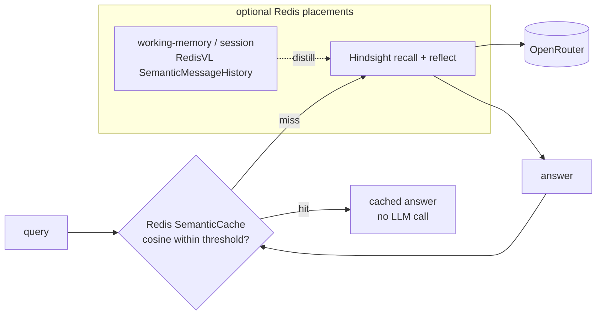

# Redis vs Hindsight — Research Report

Research question (from design-doc open question): *Memory engine: Hindsight vs
Redis-native vs both.* This report settles that fork for the RETURN/Recall
hackathon, where the pipeline is `iMessage chat.db -> canonical events ->
temporal episodes -> Hindsight` (vectorize-io/hindsight, arXiv:2512.12818).

## 1. Redis vector / memory capabilities today

**Redis as a vector DB (Redis Query Engine, formerly RediSearch)** — mature and
production-grade:

- Two index types: **FLAT** (exact brute-force, best for small sets) and
  **HNSW** (approximate ANN, for scale). Tunable `M`, `EF_CONSTRUCTION`,
  `EF_RUNTIME`.
- Distance metrics: L2, Cosine, Inner Product.
- **Hybrid search**: vector KNN combined with full-text and metadata filters in
  one query (`FT.SEARCH ... =>[KNN k @vec $blob]`).
- In-memory: very low latency; cost/scale bounded by RAM.

**"Redis for AI" stack:**

- **RedisVL** (Redis Vector Library, Python): vector search, semantic caching,
  embeddings management.
- **Redis Agent Memory Server**: a dedicated agent-memory product (the most
  relevant piece for this question).
- **LangGraph Redis checkpointer**: agent state persistence.

**What the Redis Agent Memory Server actually does** (from its README/docs, the
strongest source pulled):

- Two-tier memory: **working memory** (session-scoped — messages, summaries,
  metadata) and **long-term memory** (persistent, searchable).
- **Automatic extraction**: topic extraction, entity recognition, conversation
  summarization, and configurable strategies (`discrete`, `summary`,
  `preferences`, `custom`) run by background workers. So it does do LLM-based
  discrete fact extraction and dedup.
- Semantic + keyword + hybrid search; pluggable vector backends; multi-LLM
  (OpenAI/Anthropic/Bedrock/Ollama/etc.); REST + **MCP** interfaces; Python SDK
  with LangChain.
- **What it does NOT do**: no reflection, no cross-memory synthesis, no
  generation of beliefs/principles. The docs reference "semantic vs episodic
  memory" but show no mechanism that synthesizes new insights or connections
  across memories. It extracts and summarizes; it does not reflect.

## 2. The store-vs-cognition split (the crux)

Hindsight's value decomposes into two layers:

- **Store/retrieval layer** (embedded Postgres + pgvector, ANN search): fully
  commoditized. Redis matches or beats this on latency and ops simplicity.
- **Cognitive pipeline** (LLM fact extraction, entity resolution, four-network
  organization — World / Experiences / Entities / Beliefs — and especially
  **reflect**, which synthesizes non-obvious cross-memory connections and
  evolving principles): this is the differentiator and the demo "money shot."

Redis-the-database replaces only the first layer. Even the Redis Agent Memory
Server — which climbs higher than raw Redis — covers extraction + summarization
but stops short of reflection / principle-synthesis. So the part of Hindsight
you actually demo (non-obvious connections across episodes) has **no Redis-side
equivalent**; you would rebuild it yourself.

## 3. Replacement feasibility

"Redis replaces Hindsight" really means "use Redis as the store and **rebuild
the extraction + four-network + reflect pipeline yourself.**"

- Extraction/summarization: partly covered by the Agent Memory Server, so not
  from scratch.
- Reflection / cross-episode synthesis / evolving beliefs: **not covered by
  anything in the Redis ecosystem** — you'd write it from scratch (prompt
  design, scheduling, network structure, eval). Not a 24h job, and it's the
  riskiest, highest-value part of Hindsight that's already working.

## 4. Hybrid / comparable frameworks

Sane hybrid pattern: Redis as fast vector store / working-memory / cache layer,
with a cognition framework on top. Comparable memory frameworks (all sit *above*
a vector store, often Redis/pgvector/Qdrant):

- **Mem0** — LLM-based extraction + consolidation/update of salient facts;
  supports pluggable vector backends including Redis. Light on true reflection.
- **Zep** (Graphiti engine) — temporal knowledge graph of facts/entities/
  relationships over time; closest to Hindsight's temporal+entity story, but
  graph-centric rather than reflection-centric.
- **Letta / MemGPT** — OS-style self-editing memory hierarchy (core vs
  archival); the agent manages memory, not a reflection engine.

The "reflection → higher-level insight" capability (Generative Agents lineage)
is exactly what Hindsight leans into and what these only partially do.

**Uncertainty flag:** Mem0/Zep current deep docs timed out on fetch, so the
per-framework reflection depth is directional, not exhaustively verified. The
structural claim (frameworks sit on top of stores like Redis; none give you
Hindsight's reflect for free) is solid.

## 5. Recommendation for this hackathon: SKIP (don't switch, don't add)

- Hindsight already works end-to-end on real iMessage data, and its reflect step
  *is* the demo. Switching stores throws that away to rebuild infra you already
  have.
- Redis would only replace the commodity store layer while forcing you to
  re-implement extraction + reflection — net negative in 24h.
- The "more controllable" argument for Redis-native is real but is a
  *production* concern, not a *demo* one; controllability doesn't win a
  hackathon, the money-shot connection does.
- If you want a Redis story for judges without risk: optionally drop Redis in as
  a **caching / working-memory layer in front of** Hindsight (semantic cache via
  RedisVL). Low effort, additive, doesn't touch the cognition pipeline. But even
  this is optional polish — default is skip.

**Bottom line:** keep Hindsight. Don't replace or rebuild on Redis. At most, add
Redis as an optional cache layer if there's spare time near the end.

## Sources

- Redis Agent Memory Server (primary, strongest): https://github.com/redis/agent-memory-server
- Redis for AI: https://redis.io/docs/latest/develop/ai/
- RedisVL: https://docs.redisvl.com
- LangGraph Redis checkpointer: https://github.com/redis-developer/langgraph-redis
- Mem0: https://github.com/mem0ai/mem0 — plus Zep/Graphiti and Letta/MemGPT (framework comparison, directional)

*Caveat: WebSearch was intermittently unavailable during this research;
findings lean on direct fetches of the repos/docs above, which are the more
authoritative sources anyway. Two deep-doc fetches (Mem0/Zep) timed out — flagged
inline.*

---

## 6. Backend memory structure — what each system stores memories AS

A deeper follow-up: is Redis a vector/RAG store, a graph DB, or an episodic/
semantic memory model — and how does that compare to Hindsight? This section
classifies the **storage substrate**, not the surface API.

### 6.1 Redis: flat vector + metadata, **not a graph**

Redis stores vectors + metadata in **Hashes or JSON documents**, indexed by the
Redis Query Engine (RediSearch). Two vector index types — **FLAT** (exact KNN)
and **HNSW** (approximate ANN); metrics COSINE / L2 / IP; KNN, range queries, and
metadata/hybrid filtering. Redis treats vectors as a data type within a broader
database, not a standalone vector store. **So: flat vector + metadata records.**

**Redis is no longer a graph DB.** RedisGraph was deprecated — last major release
2.12, maintenance only through **end of January 2025**, then EOL. Redis did not
replace it natively; the continuing codebase lives on as the **FalkorDB** fork (a
separate product, not Redis). Any "Redis graph memory" claim is stale.

**RedisVL** (Python) is pure vector tooling: vector index, `SemanticCache`, and
`SemanticMessageHistory` (role-based chat history by recency or similarity). It
imposes **no episodic/semantic memory typing** — these are LLM-context utilities,
not a memory taxonomy.

### 6.2 Redis Agent Memory Server: vector + **typed** metadata, still no edges

This is the one Redis layer that *does* impose a memory-type taxonomy. From
`agent_memory_server/models.py`:

```python
class MemoryTypeEnum(str, Enum):
    EPISODIC = "episodic"
    SEMANTIC = "semantic"
    MESSAGE  = "message"
```

`MemoryRecord` carries `text`, `memory_type`, `topics`, `entities`, `event_date`,
`namespace`, `user_id`, `session_id`, `pinned`, `extraction_strategy`, etc.
Two-tier: **working memory** (session messages + summary) and **long-term**
(embedded vectors + metadata, with topic/entity extraction and dedup).

**Crucial nuance:** `entities` and `topics` are **metadata fields on each flat
record**, *not* traversable edges between memories. Retrieval is vector
similarity + metadata filtering. There is **no graph and no relationship
modeling** — it has episodic/semantic *typing* and an *entities field*, which is
easy to mistake for a graph, but it is not one.

### 6.3 Mem0 — the "hybrid" story has changed (corrects §4)

The well-known "mem0 = vector + graph + KV hybrid" is **outdated for the OSS
SDK.** Mem0 **removed external graph-store support** (Neo4j/Memgraph/Kuzu/AGE/
Neptune `enable_graph`/`graph_store` config) and replaced it with built-in
**entity linking**: entities are extracted during `add` and stored in a parallel
vector collection (`{collection}_entities`) in the *same vector store*; memories
sharing entities are linked via **retrieval ranking boosts**, not a traversable
graph (the old `relations` field is gone). Current OSS mem0 ≈ **vector-store-only
with entity-vector linking** (semantic + BM25 + entity matching fused). It labels
episodic/semantic/factual memory types but keeps them in one layered vector
architecture, not physically separate stores.

> ⚠️ **Uncertainty:** this removal is documented for the **open-source SDK**.
> Whether mem0's **hosted/Platform** product still offers a managed graph is
> unverified (search was transiently down). Treat "mem0 = graph hybrid" as
> deprecated for OSS, unconfirmed for hosted.

Can Redis back mem0? Only as the **vector store** — and since mem0 no longer uses
an external graph at all, RedisGraph being dead is moot.

### 6.4 Zep / Graphiti — the graph-native end of the spectrum

[Graphiti](https://github.com/getzep/graphiti) is a **bi-temporal knowledge
graph**: **Entities** (nodes with evolving summaries), **Facts/Relationships**
(Entity→Relationship→Entity edges with validity windows), **Episodes**
(provenance — the raw data each fact derives from), and custom Pydantic
ontologies. It tracks when a fact became true and when it was superseded, with
automatic fact invalidation (facts preserved, not deleted). Retrieval = semantic
embeddings + BM25 + **graph traversal**. Backends: **Neo4j** (primary),
**FalkorDB**, **Amazon Neptune**. This is the true graph-DB end.

### 6.5 The comparison table

| System | Backend structure | Episodic vs semantic typing | Entity / relationship modeling | Reflection (generates NEW cross-memory insight?) | Where it sits |
|---|---|---|---|---|---|
| **Redis (raw / RedisVL)** | Vector (FLAT/HNSW) + metadata in Hash/JSON; **no graph** (RedisGraph EOL Jan 2025) | No | No (vector + metadata) | No | Pure store / infra primitive |
| **Redis Agent Memory Server** | Vector + **typed** metadata flat records | **Yes** (`episodic`/`semantic`/`message`) | `entities`/`topics` as **metadata only — no edges** | No (extract / dedup / summarize) | Store + light typing & extraction |
| **Mem0 (current OSS)** | **Vector-only** + parallel `_entities` vector collection (graph store removed) | Yes (episodic/semantic/factual labels) | Entities linked via **ranking boost**, not edges | No | Store + retrieval-time linking |
| **Zep / Graphiti** | **Graph DB** (Neo4j/FalkorDB/Neptune), bi-temporal | Episodes + entity/fact nodes, explicit | **Yes** — nodes + typed edges + temporal validity | Partial (fact invalidation, evolving summaries) | Graph-native store + temporal reasoning |
| **Hindsight (ours)** | **Vector** (Postgres + pgvector) | **Yes** — 4 networks: world/experience/entities/beliefs | Entity resolution + entity summaries; beliefs as a network | **Yes** — REFLECT synthesizes connections + principles | **Cognitive layer** on a vector store |

**Spectrum:** raw Redis (infra) → Redis Agent Memory Server / mem0 (vector +
typing/extraction) → **Hindsight** (vector + full cognitive pipeline + reflection)
→ Graphiti (graph-native + temporal). Only Hindsight and Graphiti add structure
beyond flat records; **only Hindsight generates genuinely new synthesized
beliefs/principles** — which is our demo.

### 6.6 Where Redis fits in our stack (keeping Hindsight)

Redis is **complementary infrastructure**, not a Hindsight replacement (no
reflection layer). Three concrete placements:



- **(a) Semantic cache in front of recall/reflect — best ROI.** RedisVL
  `SemanticCache` stores prompt-embedding → LLM-response with a COSINE
  `distance_threshold`; a near-duplicate query returns the cached answer and
  **skips the LLM call** (latency + token savings). Low effort, additive, doesn't
  touch Hindsight. Worth it even at hackathon scale if the demo repeats queries.
  Caveat: a loose threshold can serve answers for prompts that aren't truly
  equivalent.
- **(b) Working-memory / session layer** for a chat surface (RedisVL
  `SemanticMessageHistory` or the Agent Memory Server's working tier), distilled
  into Hindsight as long-term. Low–medium effort; only if the demo is
  conversational.
- **(c) Swap pgvector for Redis as the vector index.** High effort (replacing
  Hindsight's substrate), no demo-scale benefit — **skip**.

**Recommendation (unchanged, now better grounded):** keep Hindsight. If you touch
Redis at all, do **(a) the semantic cache** — small effort, visible latency/cost
win, leaves the cognition pipeline alone. The reason Redis can't *be* the memory
engine is now precise: its backend is flat vector + (at best) typed metadata with
no edges and no synthesis, while the demo's value is exactly the synthesis.

### Additional sources (§6)

- Redis Agent Memory Server models: https://github.com/redis/agent-memory-server
- RedisVL: https://github.com/redis/redis-vl-python
- Mem0 graph-memory / migration: https://docs.mem0.ai/open-source/graph_memory/overview · https://docs.mem0.ai/core-concepts/memory-types
- Graphiti: https://github.com/getzep/graphiti

*§6 uncertainty flags: RedisVL semantic-cache user-guide URL 404'd (mechanism
confirmed via the redis-vl-python repo). Mem0 hosted/Platform graph status
unverified. RedisGraph EOL date (end of Jan 2025) and FalkorDB-as-fork came from
search summaries, not a fetched Redis EOL page — directionally certain, worth a
second check before quoting formally.*
