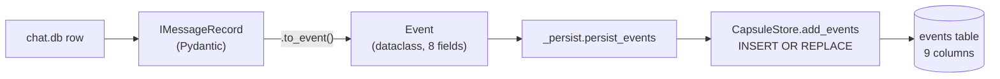
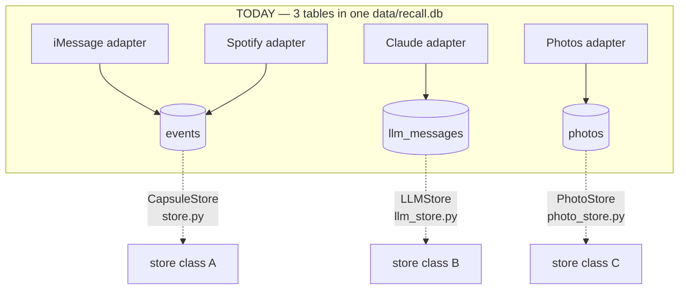
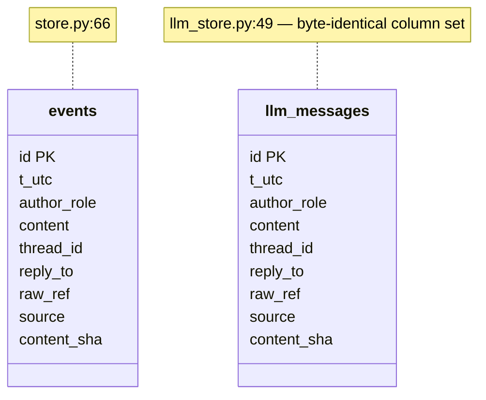
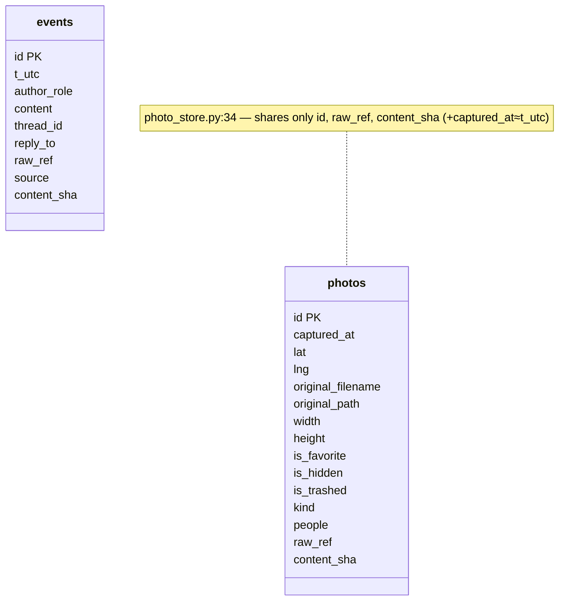
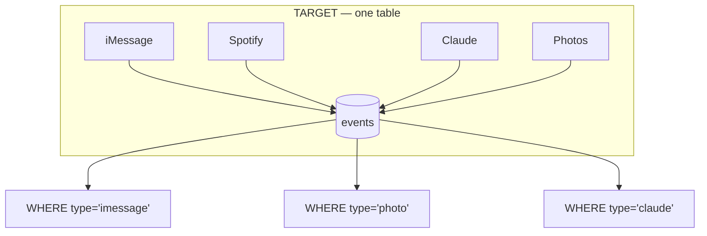
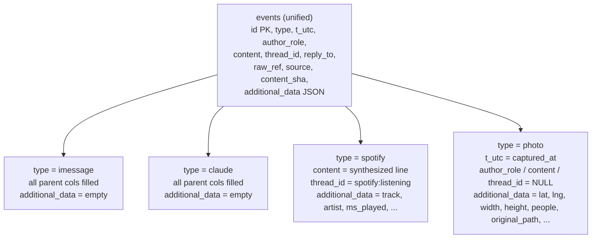
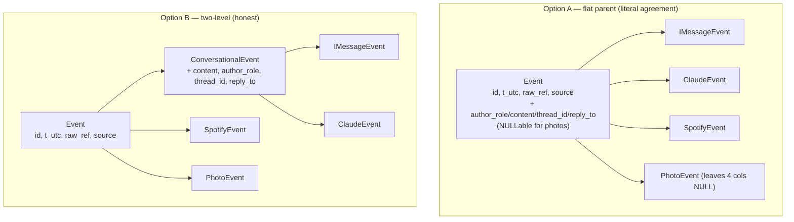

# The `store.py` events table — what it is, and how to reconcile to one table

A review of the durable SQLite storage layer on the merged
`aaryan-data-ingestion` branch (Derek's spotify+imessage adapters merged in),
focused on the `events` table in `src/recall/store.py`, the two sibling tables
Aaryan added, and the single-table design you and Derek agreed on.

---

## 1. What the `events` table is doing today

`src/recall/store.py` holds the **durable, ground-truth store** that sits *beside*
Hindsight. Hindsight keeps the *synthesized* memory (episodic / semantic /
principles); this store keeps the *raw rows* those are derived from, so a
principle can always be traced back to its source rows.

It owns three tables: `capsules`, `media` (user-created "active" data), and
**`events`** — the passive raw_data from message sources.

### The `events` schema (`store.py:66-76`)

```sql
CREATE TABLE IF NOT EXISTS events (
    id           TEXT PRIMARY KEY,   -- 16-char sha256 prefix, stable per message
    t_utc        TEXT NOT NULL,      -- ISO-8601 UTC timestamp
    author_role  TEXT NOT NULL,      -- "self" | "other"
    content      TEXT NOT NULL,      -- plain-text body
    thread_id    TEXT NOT NULL,      -- conversation id
    reply_to     TEXT,               -- id of the message replied to, nullable
    raw_ref      TEXT NOT NULL,      -- pointer back to source, e.g. "chat.db#ROWID"
    source       TEXT NOT NULL,      -- "imessage" | "claude" | ...
    content_sha  TEXT NOT NULL       -- provenance hash of `content`
);
CREATE INDEX idx_events_source ON events(source);
CREATE INDEX idx_events_thread ON events(thread_id);
```

Columns 1-8 are exactly the fields of the canonical `recall.schema.Event`
dataclass. The 9th, `content_sha`, is the only extra: a SHA-256 of `content` as
ingested, so you can later **prove a stored row is byte-identical to what you
saw** even if the original `chat.db` is vacuumed or lost. It is dropped on read
(`_row_to_event`, `store.py:263-266`) and checked by `verify_event`.

### How a row gets in



`add_events` (`store.py:211-244`) is **idempotent on `id`** (`INSERT OR REPLACE`),
so re-ingesting a source never duplicates. `_persist.py` is the shared helper
Derek routes both iMessage and Spotify through — so for *his* two sources, the
"one unified events table" idea already works.

---

## 2. The problem: three tables for one concept

Aaryan's two sources did **not** go through `events`. Each got its own table and
its own store class.



### `events` vs `llm_messages` — literally the same table



`llm_messages` (`llm_store.py:49-59`) has the **same 9 columns** as `events`.
The only reason it exists is that Aaryan's Claude adapter emits a Pydantic
`ChatEvent` instead of the dataclass `Event`, and chose a sibling table rather
than editing `store.py`. **These two tables should be one row.** A `claude` row
already fits the `events` schema with zero changes (`source="claude"`).

### `photos` — genuinely different shape



`photos` (`photo_store.py:34-50`) shares only **`id`, `raw_ref`, `content_sha`**
with `events`, plus `captured_at` which is morally `t_utc`. Everything else
(`lat`, `lng`, `width`, `original_path`, `people`, ...) is photo-only. Photos are
**not conversational** — they have no `content`, `author_role`, `thread_id`, or
`reply_to`. This is the case that the single-table design has to handle
deliberately.

### Duplicated plumbing

All three store classes copy the same connection machinery — `_connect` and
`_cursor` are **byte-identical** across `store.py:109-125`, `llm_store.py:94-110`,
`photo_store.py:119-135` (~76 redundant lines total). Derek reused `store.py`;
Aaryan wrote two parallel modules.

---

## 3. The agreed design: ONE table

Parent `Event` model + per-source children; **one table holding every event
ever**, with:

- `id` (the parent's id) as the primary key,
- a `type` discriminator column (which child this row is),
- every parent-`Event` field as its own column,
- one `additional_data` JSON column for the child's extra fields.



# TODO: what about type='spotify'?

### Target schema

```sql
CREATE TABLE events (
    id              TEXT PRIMARY KEY,
    type            TEXT NOT NULL,          -- discriminator: imessage|claude|spotify|photo
    t_utc           TEXT NOT NULL,          -- parent Event fields ↓
    author_role     TEXT,                   -- nullable now (photos have none)
    content         TEXT,                   -- nullable now (photos have none)
    thread_id       TEXT,                   -- nullable now
    reply_to        TEXT,
    raw_ref         TEXT NOT NULL,
    source          TEXT NOT NULL,
    content_sha     TEXT NOT NULL,
    additional_data TEXT NOT NULL DEFAULT '{}'  -- JSON of child-only fields
);
```

### What lands where



- **iMessage / Claude rows:** map 1:1 onto the parent columns; `additional_data`
  is empty. `llm_messages` disappears.
- **Spotify rows:** parent columns mostly fit (`content` is the synthesized
  "Listened to ..." line); the music metadata (`track`, `artist`, `ms_played`,
  `kind`, ...) goes into `additional_data`.
- **Photo rows:** `captured_at` → `t_utc`; the 11 photo-only columns → JSON in
  `additional_data`; conversational columns are NULL.

---

## 4. The one decision before coding

The agreed rule was "every field common to all four goes in the parent." But the
**true intersection of all four sources is only `{id, t_utc, raw_ref, source}`** —
`content` / `author_role` / `thread_id` / `reply_to` are real for iMessage and
Claude, faked constants for Spotify, and **meaningless for photos**.

Two ways to resolve it:



- **Option A** keeps the conversational fields as nullable columns in the one
  table — simplest DB, matches your literal description, but the schema has four
  columns that are always NULL for photos.
- **Option B** puts only the genuine 4-way intersection in the parent and groups
  the conversational fields under a `ConversationalEvent` middle layer. Cleaner
  model, same single table on disk (the middle layer is just Python).

> **This is the call I need from you.** Both produce one table; they differ in
> what the parent Pydantic model looks like and whether photos leave 4 columns
> permanently NULL.

# TODO: yes, phtoos leaves 4 columns genuinely null that's okay

---

## 5. Other things to settle while reconciling

- **`Event` is a frozen dataclass, not Pydantic.** Children can't inherit it as
  written. Making `Event` a Pydantic `BaseModel` is the prerequisite, and it
  breaks `to_dict`/`from_dict`/JSONL round-trips in `schema.py`, `store.py`,
  `episodes.py`, `load.py` — all fixable, but it's the load-bearing change.
- **`ChatEvent` (`models/chat_event.py`) becomes redundant** once `Event` is
  Pydantic — it's a hand-kept mirror of the same 8 fields.
- **`content_sha` means two different things.** `store.py:31` hashes the
  `content` string; `photo_store.py:57` hashes a JSON of metadata (photos have no
  `content`). One table needs one agreed hash rule, and photos currently have
  **no `verify_*` method** at all.
- **Re-route the writers.** `_persist.py` already is the single-table path;
  the Claude and Photos adapters must go through it too, or they'll keep creating
  the orphan `llm_messages` / `photos` tables.
- **Migration:** existing dev `data/recall.db` files already hold `llm_messages`
  and `photos` rows — backfill them into `events` (with `type`/`additional_data`)
  and drop the old tables, or readers silently miss history.

---

## 6. Two correctness bugs in the merged code (independent of the redesign)

Both reproduced; both abort an entire ingest run on one bad row:

1. **`adaptors/imessage.py:85`** — a truncated `attributedBody` length prefix
   raises an uncaught `struct.error`, killing the whole iMessage ingest instead
   of skipping the row.
2. **`adaptors/photos.py:117`** — a NULL `ZDATECREATED` does `None + 978_307_200`
   → `TypeError`, killing photo ingest.

---

*Next step: tell me Option A or B (and anything you'd change about the schema
above), and I'll draft the Pydantic-`Event` + single-table refactor as a plan.*
